.. contents:: Table of Contents
   :depth: 5

nvflex
------
- generate html+inline-css  from a string template
- only flex-related-css  and html generated,not any javascript included

install
-------
- npm install -g nvflex

examples
--------

plain
=====
    
    ::

        nvflex_plain --input "
        * ##    ##  ##     ##  ########  ##        ########  ##    ##  *
        * ###   ##  ##     ##  ##        ##        ##        ##    ##  *
        * ####  ##  ##     ##  ##        ##        ##        ###  ###  *
        * ## ## ##  ###   ###  #####     ##        #####       ####    *
        * ##  ####    ## ##    ##        ##        ##        ###  ###  *
        * ##   ###     ###     ##        ##        ##        ##    ##  *
        * ##    ##      #      ##        ########  ########  ##    ##  *
        " --output nvflex
        
        #first use some character-genrator such as http://patorjk.com/software/taag/
        #to genertator a txt-template(dont use some shell-forbidden chars suchas $)

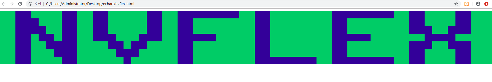

border
======
    
    ::
        
        nvflex_border --input "
        VVVVVVVV@@@@@@@@VVVVVVVV
        VVVVVVVV@@@@@@@@VVVVVVVV
        VVVVVVVV@@@@@@@@VVVVVVVV
        TTTTTTTTttttttttTTTTTTTT
        VVVVVVVV@@@@@@@@VVVVVVVV
        VVVVVVVV@@@@@@@@VVVVVVVV
        VVVVVVVV@@@@@@@@VVVVVVVV
        TTTTTTTTttttttttTTTTTTTT
        " --output border

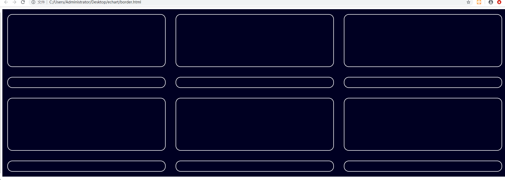

btn0
====
    
    ::
        
        nvflex_btn --input "
        ****@@@@****
        ****@@@@****
        ####@@@@####
        ####@@@@####"  --output btn-example-0

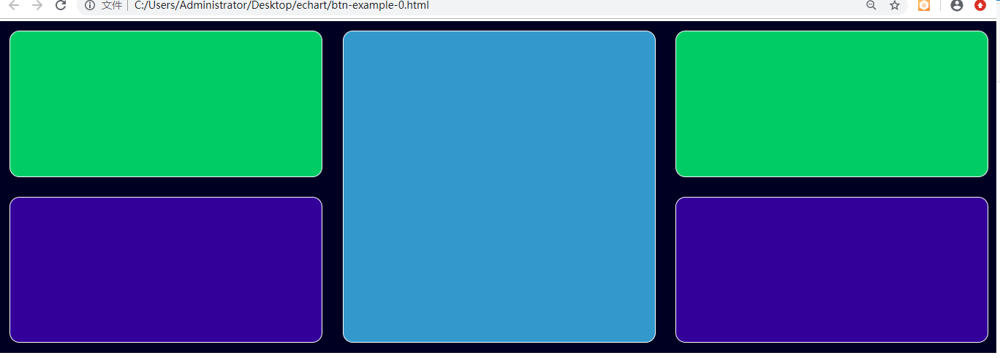

btn1
====
    
    ::
        
        nvflex_btn --input "
        AA @ @ @ @ @
        BB#####%%%%%
        CC#####%%%%%
        DD----------
        EE%%%%%#####
        FF%%%%%#####"  --output btn-example-1

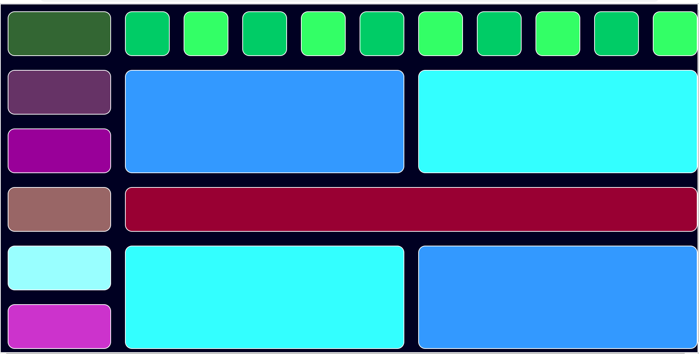

usage
-----
- nvflex_btn --input "<string or txt-tem-file-name>" --cfg "<config-json-file-name>" --output "<output filename>"
- nvflex_border --input "<string or txt-tem-file-name>" --cfg "<config-json-file-name>" --output "<output filename>"
- nvflex_plain --input "<string or txt-tem-file-name>" --cfg "<config-json-file-name>" --output "<output filename>"
- nvflex_btn_inline --input "<string or txt-tem-file-name>" --cfg "<config-json-file-name>" --output "<output filename>"
- nvflex_border_inline --input "<string or txt-tem-file-name>" --cfg "<config-json-file-name>" --output "<output filename>"
- nvflex_plain_inline --input "<string or txt-tem-file-name>" --cfg "<config-json-file-name>" --output "<output filename>"
- cfg is optional

CLI
===

    
    ::
        
        #npm install -g nvflex

        nvflex_btn_inline --input "
        AAAAAABBBBBBCCCCCCDDDDDDDDDEEEEEEFFFFFFGGGGGG
        AAAAAABBBBBBCCCCCCDDDDDDDDDEEEEEEFFFFFFGGGGGG
        HHHHHHHHHIIIIIIIIIJJJJJJJJJKKKKKKKKKLLLLLLLLL
        HHHHHHHHHIIIIIIIIIJJJJJJJJJKKKKKKKKKLLLLLLLLL
        HHHHHHHHHIIIIIIIIIJJJJJJJJJKKKKKKKKKLLLLLLLLL
        HHHHHHHHHIIIIIIIIIJJJJJJJJJKKKKKKKKKLLLLLLLLL
        MMMMMMMMMMMMMMMMMMNNNNNNNNNNNNNNNNNNOOOOOOOOO
        MMMMMMMMMMMMMMMMMMNNNNNNNNNNNNNNNNNNOOOOOOOOO
        MMMMMMMMMMMMMMMMMMNNNNNNNNNNNNNNNNNNOOOOOOOOO
        MMMMMMMMMMMMMMMMMMNNNNNNNNNNNNNNNNNNOOOOOOOOO
        PPPPPPPPPPPPPPPPPPNNNNNNNNNNNNNNNNNNQQQQQQQQQ
        PPPPPPPPPPPPPPPPPPNNNNNNNNNNNNNNNNNNQQQQQQQQQ
        PPPPPPPPPPPPPPPPPPNNNNNNNNNNNNNNNNNNQQQQQQQQQ
        PPPPPPPPPPPPPPPPPPNNNNNNNNNNNNNNNNNNQQQQQQQQQ
        RRRRRRRRRSSSSSSSSSTTTTTTTTTTTTTTTTTTUUUUUUUUU
        RRRRRRRRRSSSSSSSSSTTTTTTTTTTTTTTTTTTUUUUUUUUU
        RRRRRRRRRSSSSSSSSSTTTTTTTTTTTTTTTTTTUUUUUUUUU
        RRRRRRRRRSSSSSSSSSTTTTTTTTTTTTTTTTTTUUUUUUUUU" --output btn_inline

        nvflex_border_inline --input "
        AAAAAABBBBBBCCCCCCDDDDDDDDDEEEEEEFFFFFFGGGGGG
        AAAAAABBBBBBCCCCCCDDDDDDDDDEEEEEEFFFFFFGGGGGG
        HHHHHHHHHIIIIIIIIIJJJJJJJJJKKKKKKKKKLLLLLLLLL
        HHHHHHHHHIIIIIIIIIJJJJJJJJJKKKKKKKKKLLLLLLLLL
        HHHHHHHHHIIIIIIIIIJJJJJJJJJKKKKKKKKKLLLLLLLLL
        HHHHHHHHHIIIIIIIIIJJJJJJJJJKKKKKKKKKLLLLLLLLL
        MMMMMMMMMMMMMMMMMMNNNNNNNNNNNNNNNNNNOOOOOOOOO
        MMMMMMMMMMMMMMMMMMNNNNNNNNNNNNNNNNNNOOOOOOOOO
        MMMMMMMMMMMMMMMMMMNNNNNNNNNNNNNNNNNNOOOOOOOOO
        MMMMMMMMMMMMMMMMMMNNNNNNNNNNNNNNNNNNOOOOOOOOO
        PPPPPPPPPPPPPPPPPPNNNNNNNNNNNNNNNNNNQQQQQQQQQ
        PPPPPPPPPPPPPPPPPPNNNNNNNNNNNNNNNNNNQQQQQQQQQ
        PPPPPPPPPPPPPPPPPPNNNNNNNNNNNNNNNNNNQQQQQQQQQ
        PPPPPPPPPPPPPPPPPPNNNNNNNNNNNNNNNNNNQQQQQQQQQ
        RRRRRRRRRSSSSSSSSSTTTTTTTTTTTTTTTTTTUUUUUUUUU
        RRRRRRRRRSSSSSSSSSTTTTTTTTTTTTTTTTTTUUUUUUUUU
        RRRRRRRRRSSSSSSSSSTTTTTTTTTTTTTTTTTTUUUUUUUUU
        RRRRRRRRRSSSSSSSSSTTTTTTTTTTTTTTTTTTUUUUUUUUU" --output border_inline        

        nvflex_plain_inline --input "
        AAAAAABBBBBBCCCCCCDDDDDDDDDEEEEEEFFFFFFGGGGGG
        AAAAAABBBBBBCCCCCCDDDDDDDDDEEEEEEFFFFFFGGGGGG
        HHHHHHHHHIIIIIIIIIJJJJJJJJJKKKKKKKKKLLLLLLLLL
        HHHHHHHHHIIIIIIIIIJJJJJJJJJKKKKKKKKKLLLLLLLLL
        HHHHHHHHHIIIIIIIIIJJJJJJJJJKKKKKKKKKLLLLLLLLL
        HHHHHHHHHIIIIIIIIIJJJJJJJJJKKKKKKKKKLLLLLLLLL
        MMMMMMMMMMMMMMMMMMNNNNNNNNNNNNNNNNNNOOOOOOOOO
        MMMMMMMMMMMMMMMMMMNNNNNNNNNNNNNNNNNNOOOOOOOOO
        MMMMMMMMMMMMMMMMMMNNNNNNNNNNNNNNNNNNOOOOOOOOO
        MMMMMMMMMMMMMMMMMMNNNNNNNNNNNNNNNNNNOOOOOOOOO
        PPPPPPPPPPPPPPPPPPNNNNNNNNNNNNNNNNNNQQQQQQQQQ
        PPPPPPPPPPPPPPPPPPNNNNNNNNNNNNNNNNNNQQQQQQQQQ
        PPPPPPPPPPPPPPPPPPNNNNNNNNNNNNNNNNNNQQQQQQQQQ
        PPPPPPPPPPPPPPPPPPNNNNNNNNNNNNNNNNNNQQQQQQQQQ
        RRRRRRRRRSSSSSSSSSTTTTTTTTTTTTTTTTTTUUUUUUUUU
        RRRRRRRRRSSSSSSSSSTTTTTTTTTTTTTTTTTTUUUUUUUUU
        RRRRRRRRRSSSSSSSSSTTTTTTTTTTTTTTTTTTUUUUUUUUU
        RRRRRRRRRSSSSSSSSSTTTTTTTTTTTTTTTTTTUUUUUUUUU" --output plain_inline

template        
~~~~~~~~

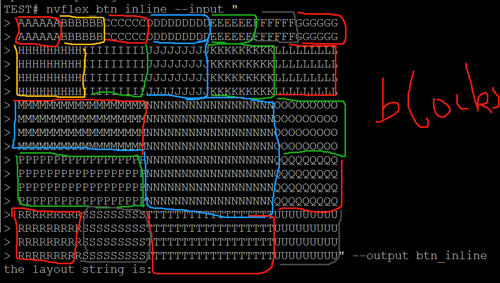

layout
~~~~~~

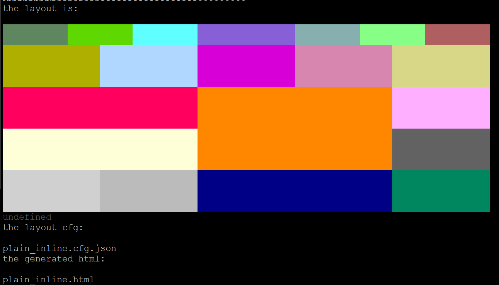

generated-html
~~~~~~~~~~~~~~
    
- `nvflex_btn.html <docs/btn.html>`_
- `nvflex_border.html <docs/border.html>`_
- `nvflex_plain.html <docs/plain.html>`_
- `nvflex_btn_inline.html <docs/btn_inline.html>`_
- `nvflex_border_inline.html <docs/border_inline.html>`_
- `nvflex_plain_inline.html <docs/plain_inline.html>`_

img
###

- bgn-img

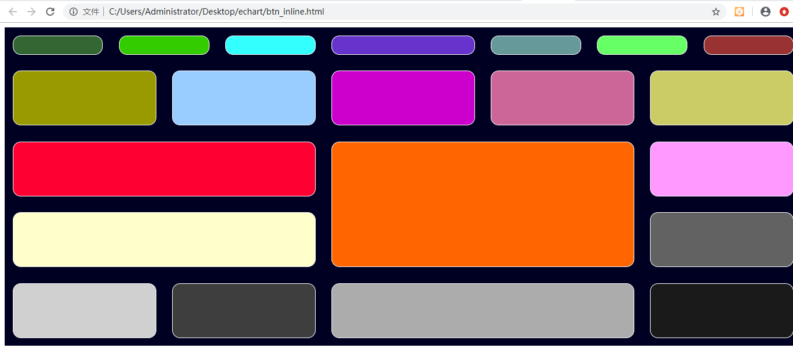

- border-img

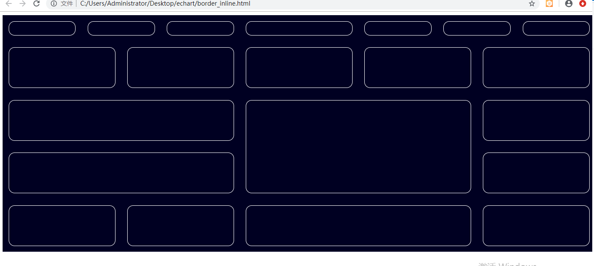

- plain-img

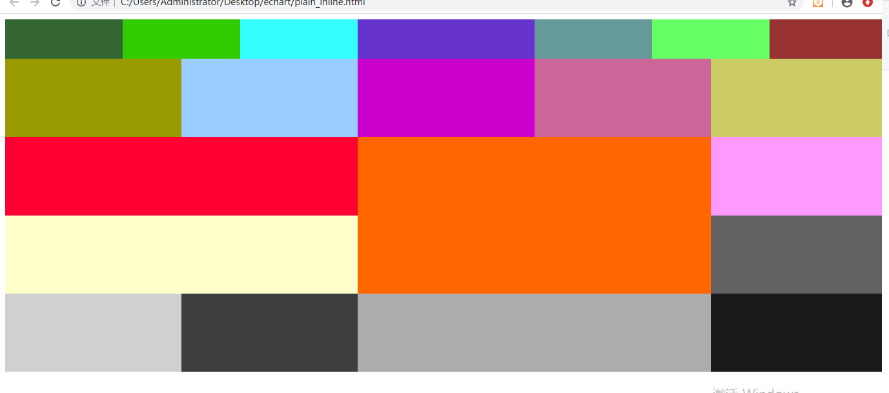

generated-dflt-cfg
~~~~~~~~~~~~~~~~~~
- `nvflex_btn.cfg.json <docs/btn.cfg.json>`_
- `nvflex_border.cfg.json <docs/border.cfg.json>`_
- `nvflex_plain.cfg.json <docs/plain.cfg.json>`_
- `nvflex_btn_inline.cfg.json <docs/btn_inline.cfg.json>`_
- `nvflex_border_inline.cfg.json <docs/border_inline.cfg.json>`_
- `nvflex_plain_inline.cfg.json <docs/plain_inline.cfg.json>`_

DIFFRENCE-BETWEEN INLINE AND OUTBAND
====================================

outband
~~~~~~~

- generate seperated css in head
- nvflex_btn
- nvflex_border
- nvflex_plain

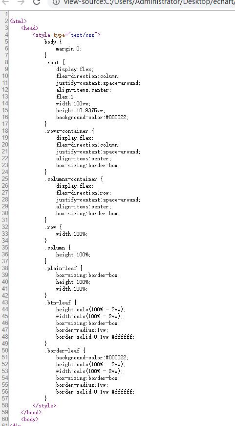

inline
~~~~~~
- css is in style="..." in each element
- nvflex_btn_inline
- nvflex_border_inline
- nvflex_plain_inline

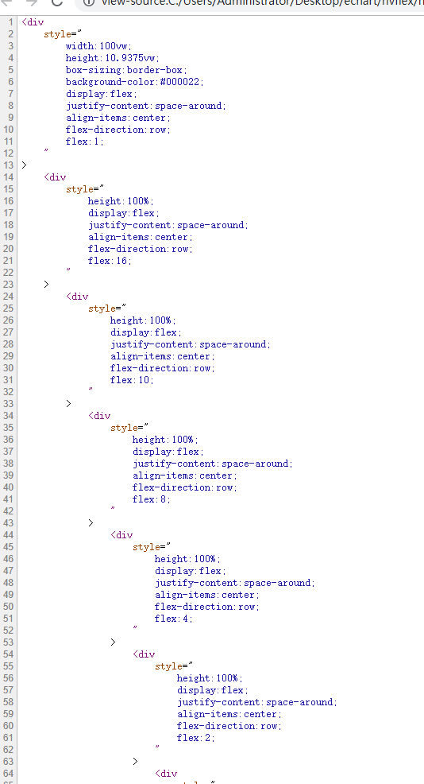

RESTRICT
========
- DONT use shell-cmd-characters, such as $
- if a tem include the-below pattern,it could not be aggregate two->one

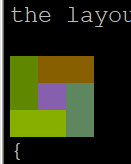

API
===

    ::

        > var nvflex=require('nvflex')
        undefined
        > nvflex
        {
          playout: [Function: playout],
          get_dflt_cfg: [Function: get_dflt_cfg],
          s2html: [Function: s2html],
          cellfunc: {
            parse: [Function: parse],
            creat_cell: [Function: creat_cell],
            cmat2carr: [Function: cmat2carr],
            get_submat_via_tlbr_from_cmat: [Function: get_submat_via_tlbr_from_cmat],
            get_subcarr_via_tlbr_from_cmat: [Function: get_subcarr_via_tlbr_from_cmat],
            get_cmat_rn: [Function: get_cmat_rn],
            get_cmat_cn: [Function: get_cmat_cn],
            get_cmat_rncn: [Function: get_cmat_rncn],
            is_cell_in_cmat: [Function: is_cell_in_cmat],
            is_continuous: [Function: is_continuous],
            is_all_having_same_rune: [Function: is_all_having_same_rune],
            is_zone: [Function: is_zone],
            is_tl_of: [Function: is_tl_of],
            is_br_of: [Function: is_br_of],
            creat_zone: [Function: creat_zone],
            iter_next: [Function: iter_next],
            s2cmat_bmap: [Function: s2cmat_bmap],
            get_clrd: [Function: get_clrd],
            playout: [Function: playout],
            ansi256_color_control: [Function: ansi256_color_control]
          },
          zonefunc: {
            get_ledge: [Function: get_ledge],
            get_redge: [Function: get_redge],
            get_tedge: [Function: get_tedge],
            get_bedge: [Function: get_bedge],
            edge_eq: [Function: edge_eq],
            is_ladj_of: [Function: is_ladj_of],
            is_radj_of: [Function: is_radj_of],
            is_tadj_of: [Function: is_tadj_of],
            is_badj_of: [Function: is_badj_of],
            zones2znds: [Function: zones2znds],
            sort_znds_l2r: [Function: sort_znds_l2r],
            sort_znds_t2b: [Function: sort_znds_t2b],
            sort_znds_tl2br: [Function: sort_znds_tl2br],
            sort_znds_lt2rb: [Function: sort_znds_lt2rb],
            lppend: [Function: lppend],
            rppend: [Function: rppend],
            tppend: [Function: tppend],
            bppend: [Function: bppend],
            iter_next_l2r: [Function: iter_next_l2r],
            iter_next_t2b: [Function: iter_next_t2b],
            agg_l2r: [Function: agg_l2r],
            agg_t2b: [Function: agg_t2b],
            znds2tree: [Function: znds2tree],
            show_znd_tree: [Function: show_znd_tree]
          },
          whtml: {
            is_stag: [Function: is_stag],
            is_etag: [Function: is_etag],
            creat_stag: [Function: creat_stag],
            creat_etag: [Function: creat_etag],
            creat_css_str: [Function: creat_css_str],
            creat_attrib_str: [Function: creat_attrib_str],
            creat_inline_container_attrib: [Function: creat_inline_container_attrib],
            calc_hw: [Function: calc_hw],
            calc_flex: [Function: calc_flex],
            sedfs2inline_html: [Function: sedfs2inline_html],
            wrap: [Function: wrap],
            creat_outband_container_attrib: [Function: creat_outband_container_attrib],
            sedfs2outband_html: [Function: sedfs2outband_html]
          }
        }

