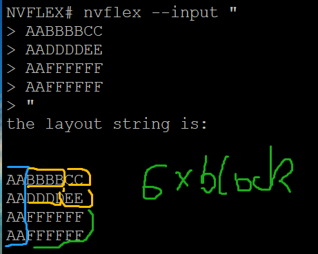
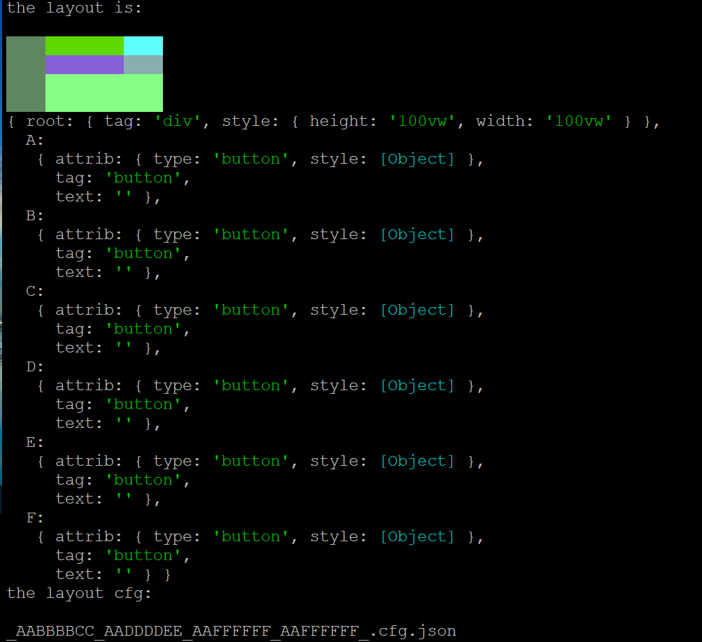
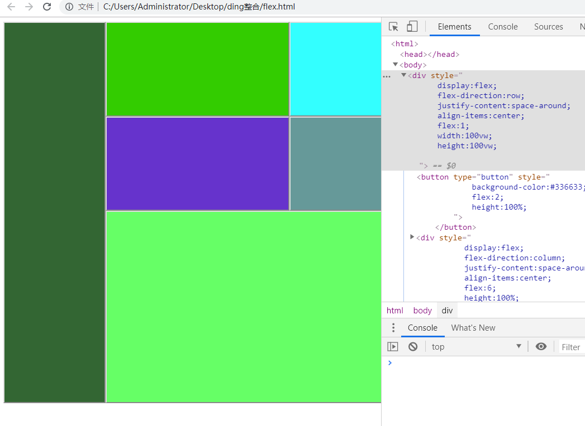
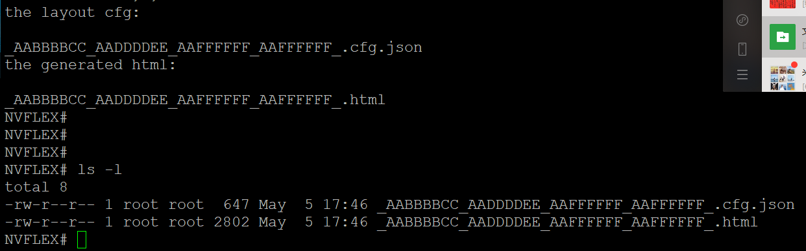
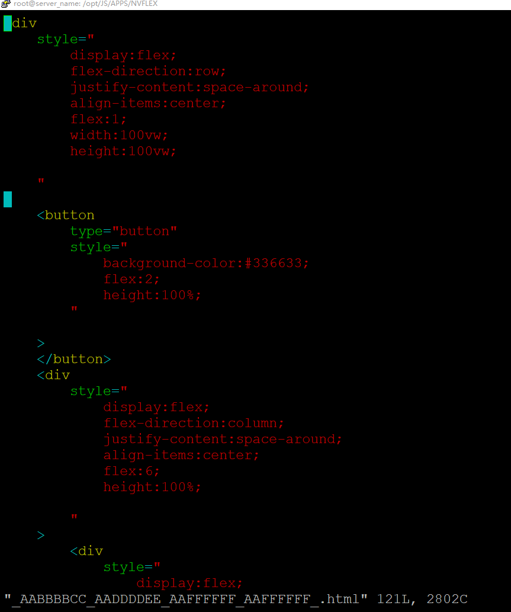
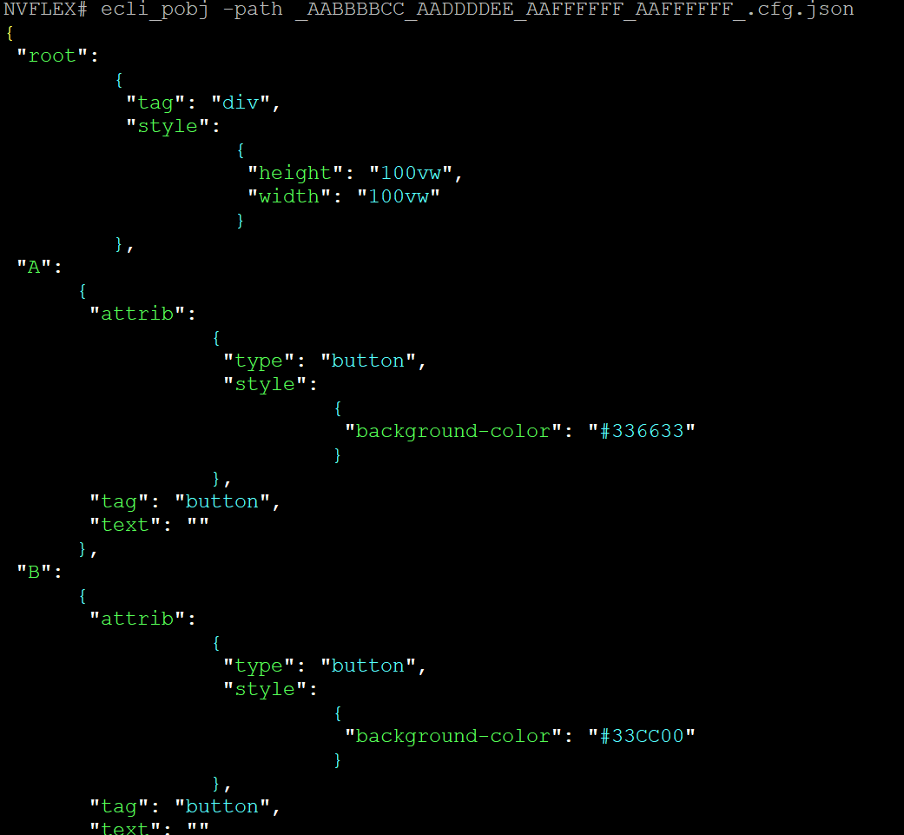

.. contents:: Table of Contents
   :depth: 5

nvflex
------
- generate html+inline-css  from a string template

install
-------
- npm install -g nvflex

usage
-----
- nvflex --input "<string rect template>" --cfg "<config json>" --output "<output filename>"
- cfg is optional
- output is optional

CLI
===

    
    ::
        
        #npm install -g nvflex

        #nvflex --input "<string rect template>"

        nvflex --input "
        AABBBBCC
        AADDDDEE
        AAFFFFFF
        AAFFFFFF
        "

template        
~~~~~~~~

layout
~~~~~~

generated-html
~~~~~~~~~~~~~~
    
    ::
         

        

            <button
                type="button"
                style="
                    background-color:#336633;
                    flex:2;
                    height:100%;
                "
        
            >
            </button>
            
 require('./zonefunc.js')
        { get_ledge: [Function: get_ledge],
          get_redge: [Function: get_redge],
          get_tedge: [Function: get_tedge],
          get_bedge: [Function: get_bedge],
          edge_eq: [Function: edge_eq],
          is_ladj_of: [Function: is_ladj_of],
          is_radj_of: [Function: is_radj_of],
          is_tadj_of: [Function: is_tadj_of],
          is_badj_of: [Function: is_badj_of],
          zones2znds: [Function: zones2znds],
          sort_znds_l2r: [Function: sort_znds_l2r],
          sort_znds_t2b: [Function: sort_znds_t2b],
          sort_znds_tl2br: [Function: sort_znds_tl2br],
          sort_znds_lt2rb: [Function: sort_znds_lt2rb],
          lppend: [Function: lppend],
          rppend: [Function: rppend],
          tppend: [Function: tppend],
          bppend: [Function: bppend],
          iter_next_l2r: [Function: iter_next_l2r],
          iter_next_t2b: [Function: iter_next_t2b],
          agg_l2r: [Function: agg_l2r],
          agg_t2b: [Function: agg_t2b],
          znds2tree: [Function: znds2tree],
          show_znd_tree: [Function: show_znd_tree] }
        >

        > require('./cellfunc.js')
        { parse: [Function: parse],
          creat_cell: [Function: creat_cell],
          cmat2carr: [Function: cmat2carr],
          get_submat_via_tlbr_from_cmat: [Function: get_submat_via_tlbr_from_cmat],
          get_subcarr_via_tlbr_from_cmat: [Function: get_subcarr_via_tlbr_from_cmat],
          get_cmat_rn: [Function: get_cmat_rn],
          get_cmat_cn: [Function: get_cmat_cn],
          get_cmat_rncn: [Function: get_cmat_rncn],
          is_cell_in_cmat: [Function: is_cell_in_cmat],
          is_continuous: [Function: is_continuous],
          is_all_having_same_rune: [Function: is_all_having_same_rune],
          is_zone: [Function: is_zone],
          is_tl_of: [Function: is_tl_of],
          is_br_of: [Function: is_br_of],
          creat_zone: [Function: creat_zone],
          iter_next: [Function: iter_next],
          s2cmat_bmap: [Function: s2cmat_bmap],
          get_clrd: [Function: get_clrd],
          playout: [Function: playout],
          ansi256_color_control: [Function: ansi256_color_control] }

        > require('./whtml.js')
        { is_stag: [Function: is_stag],
          is_etag: [Function: is_etag],
          creat_stag: [Function: creat_stag],
          creat_etag: [Function: creat_etag],
          creat_css: [Function: creat_css],
          creat_attrib: [Function: creat_attrib],
          creat_root_flex: [Function: creat_root_flex],
          calc_flex: [Function: calc_flex],
          sedfs2html: [Function: sedfs2html] }
        >

